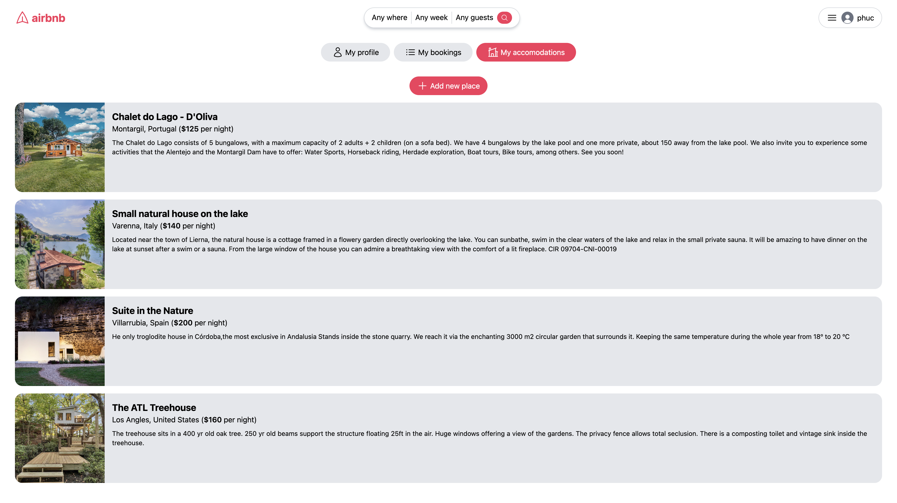
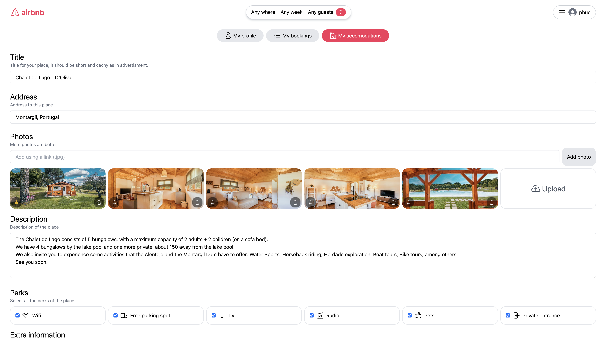

<h1 align="center">MERN Airbnb Clone Website</h1>

## Contents

- [Brief description](#brief-description)
- [Language and Tools](#language-and-tools)
- [Project details](#project-details)
- [Images](#images)

## Brief description

- This is Airbnb Clone Website built with MERN stack.
- Project link (GitHub): [mern-airbnb-clone](https://github.com/phamgiaphuc/mern-airbnb-clone)
- Project's author: Pham Gia Phuc - Acus
- Personal profile: [MyProfile](https://github.com/phamgiaphuc)

## Language and Tools

- Backend:

- Frontend

- Other tools:

## Project details

- A simple Airbnb clone website with some main features:

1. User Authentication: Sign in & Sign up with JSON Web Tokens (Login and Register pages)
2. A home page with a list of places
3. A booking page with a list of user's booking places
4. A place page with detailed information
5. A gallery page of place's photos
6. A detailed booking page showing more infos related to user's bookings
7. A page for displaying a list of user's renting accomodations
8. A form that can be filled up for renting accomodations (CRUD accomodation + upload images)
9. A user's profile page

## Images

1. Home page

2. Place page

3. Photo gallery

4. Places page

5. Booking page

6. Accomodation page (Form page)

